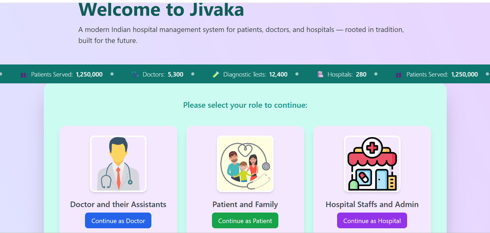
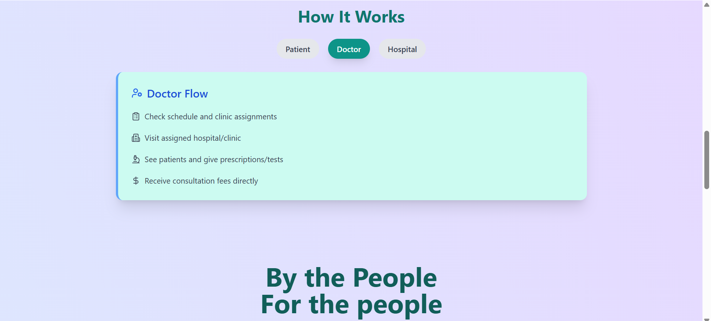

## Made By - Sayan Kundu

**B.Tech in Computer Science | Full Stack Developer | Passionate about building real-world solutions**

---

## 🔗 Links
[](https://drive.google.com/file/d/1Mhn6U396WW0DiciBdBbsP2eJP5P9CSg4/view?usp=drive_link)
[](https://www.linkedin.com/in/sayan-kundu-70b5442b6/)
[](https://github.com/sayank22)

---

# Dropbox Brand Animation Demo

Live Demo: [https://jivaka-sayankundu.vercel.app](https://jivaka-sayankundu.vercel.app)

---

# Jivaka - HealthCare Management System

Jivaka is a modern role-based hospital management platform designed for patients, doctors, and hospital admins. Responsive, secure, and optimized for mobile and desktop experiences.

## Features

- **🔐 Role-Based Access:**  
Separate flows for Patients, Doctors, and Hospital Admins.

- **📅 Appointment Management:**  
  Doctors can upload prescriptions and reports; patients can view/download them.

- **💊 Prescription & Lab Reports:**  
  Hover effects activate only after main animations complete, improving focus.

- **📊 Analytics Dashboard:**  
  Admins can view activity, slot usage, and performance data.

- **📱 Fully Responsive:**  
  Tailored views for different device sizes.


---

## 🚀 Technologies I Used

**Frontend:**
 ⚛️ React, 📦 Vite, 📍 React Route

**Backend:**
 🛠️ Node.js, 🚀 Express

**UI/UX:** 
🎞️ Framer Motion, 🎨 Tailwind CSS, 📱 Fully Responsive Design

**Database:** 
🗃️ MongoDB

**Authentication:**
 🔐 Clerk

**Frontend Deployment:**
 ▲ Vercel

**Backend Deployment:**
 🌐 Render

---

## 🌐 Live Links

**🔗 Frontend: https://jivaka-sayankundu.vercel.app**
**🔗 Backend API: https://jivaka-backend.onrender.com**

---


## Getting Started

# 1. Clone the repo
   ```bash
   git clone https://github.com/sayank22/Jivaka.git
   ```

# 2. Backend Setup
   ```bash
  cd server
npm install

   ```
**Create a .env file in /Server:**
```ini
PORT=5000
MONGODB_URI=your_mongodb_connection_string
JWT_SECRET=your_jwt_secret

```
**Run the server:**
```bash

node server.js

```

# 3. Frontend Setup
   ```bash
  cd client
npm install

   ```
**Create a .env file in /client:**
```ini
VITE_API_URL=https://your-backend-url.com

```
**Run the server:**
```bash

npm run dev

```

## Demo

See it live: [https://jivaka-sayankundu.vercel.app](https://jivaka-sayankundu.vercel.app)



